# Exercice 1
## R2
Après ajout de l'index `IDX_NUMCLIENT`
```
Plan hash value: 51045663
 
--------------------------------------------------------------------------------------------------------------
| Id  | Operation                    | Name          | Rows  | Bytes | Cost (%CPU)| Time     | Inst   |IN-OUT|
--------------------------------------------------------------------------------------------------------------
|   0 | SELECT STATEMENT             |               |    82 | 20336 |   166   (0)| 00:00:03 |        |      |
|   1 |  NESTED LOOPS                |               |       |       |            |          |        |      |
|   2 |   NESTED LOOPS               |               |    82 | 20336 |   166   (0)| 00:00:03 |        |      |
|   3 |    REMOTE                    | COMMANDE98    |    82 | 11152 |     2   (0)| 00:00:01 | SITEC~ | R->S |
|*  4 |    INDEX RANGE SCAN          | IDX_NUMCLIENT |     1 |       |     1   (0)| 00:00:01 |        |      |
|   5 |   TABLE ACCESS BY INDEX ROWID| CLIENT        |     1 |   112 |     2   (0)| 00:00:01 |        |      |
--------------------------------------------------------------------------------------------------------------
 
Query Block Name / Object Alias (identified by operation id):
-------------------------------------------------------------
 
   1 - SEL$1
   3 - SEL$1 / C1@SEL$1
   4 - SEL$1 / C@SEL$1
   5 - SEL$1 / C@SEL$1
 
Predicate Information (identified by operation id):
---------------------------------------------------
 
   4 - access("C"."NUMCLIENT"="C1"."NUMCLIENT")
 
Column Projection Information (identified by operation id):
-----------------------------------------------------------
 
   1 - (#keys=0) "C1"."NUMCDE"[NUMBER,22], "C1"."NUMCLIENT"[NUMBER,22], "C1"."ETAT"[VARCHAR2,1], 
       "C1"."PRIXC"[NUMBER,22], "C1"."DATEC"[DATE,7], "C1"."PRIORITE"[CHARACTER,15], 
       "C1"."VENDEUR"[CHARACTER,15], "C1"."COMMENTAIRE"[VARCHAR2,100], "C"."NUMCLIENT"[NUMBER,22], 
       "C"."NOM"[VARCHAR2,25], "C"."NUMPAYS"[NUMBER,22], "C"."SEGMENT"[CHARACTER,10], 
       "C"."COMMENTAIRE"[VARCHAR2,117]
   2 - (#keys=0) "C1"."NUMCDE"[NUMBER,22], "C1"."NUMCLIENT"[NUMBER,22], "C1"."ETAT"[VARCHAR2,1], 
       "C1"."PRIXC"[NUMBER,22], "C1"."DATEC"[DATE,7], "C1"."PRIORITE"[CHARACTER,15], 
       "C1"."VENDEUR"[CHARACTER,15], "C1"."COMMENTAIRE"[VARCHAR2,100], "C".ROWID[ROWID,10], 
       "C"."NUMCLIENT"[NUMBER,22]
   3 - "C1"."NUMCDE"[NUMBER,22], "C1"."NUMCLIENT"[NUMBER,22], "C1"."ETAT"[VARCHAR2,1], 
       "C1"."PRIXC"[NUMBER,22], "C1"."DATEC"[DATE,7], "C1"."PRIORITE"[CHARACTER,15], 
       "C1"."VENDEUR"[CHARACTER,15], "C1"."COMMENTAIRE"[VARCHAR2,100]
   4 - "C".ROWID[ROWID,10], "C"."NUMCLIENT"[NUMBER,22]
   5 - "C"."NOM"[VARCHAR2,25], "C"."NUMPAYS"[NUMBER,22], "C"."SEGMENT"[CHARACTER,10], 
       "C"."COMMENTAIRE"[VARCHAR2,117]
 
Remote SQL Information (identified by operation id):
----------------------------------------------------
 
   3 - SELECT /*+ USE_NL ("C1") */ "NUMCDE","NUMCLIENT","ETAT","PRIXC","DATEC","PRIORITE","VENDEUR","C
       OMMENTAIRE" FROM "COMMANDE98" "C1" (accessing 'SITECOMPLEMENT.FR' )
```
La jointure se fait dans la deuxième boucle, il faut donc lire toute la table distante et la transférer en local pour ensuite faire la joiture.

## R3
```
Plan hash value: 3532254581
 
-------------------------------------------------------------------------------------------------
| Id  | Operation          | Name       | Rows  | Bytes | Cost (%CPU)| Time     | Inst   |IN-OUT|
-------------------------------------------------------------------------------------------------
|   0 | SELECT STATEMENT   |            |    82 | 20336 |   186   (1)| 00:00:03 |        |      |
|*  1 |  HASH JOIN         |            |    82 | 20336 |   186   (1)| 00:00:03 |        |      |
|   2 |   REMOTE           | COMMANDE98 |    82 | 11152 |     2   (0)| 00:00:01 | SITEC~ | R->S |
|   3 |   TABLE ACCESS FULL| CLIENT     | 42247 |  4620K|   184   (1)| 00:00:03 |        |      |
-------------------------------------------------------------------------------------------------
 
Query Block Name / Object Alias (identified by operation id):
-------------------------------------------------------------
 
   1 - SEL$1
   2 - SEL$1 / C1@SEL$1
   3 - SEL$1 / C@SEL$1
 
Predicate Information (identified by operation id):
---------------------------------------------------
 
   1 - access("C"."NUMCLIENT"="C1"."NUMCLIENT")
 
Column Projection Information (identified by operation id):
-----------------------------------------------------------
 
   1 - (#keys=1) "C1"."NUMCLIENT"[NUMBER,22], "C"."NUMCLIENT"[NUMBER,22], 
       "C1"."NUMCDE"[NUMBER,22], "C1"."COMMENTAIRE"[VARCHAR2,100], "C1"."ETAT"[VARCHAR2,1], 
       "C1"."PRIXC"[NUMBER,22], "C1"."DATEC"[DATE,7], "C1"."PRIORITE"[CHARACTER,15], 
       "C1"."VENDEUR"[CHARACTER,15], "C"."COMMENTAIRE"[VARCHAR2,117], "C"."NOM"[VARCHAR2,25], 
       "C"."NUMPAYS"[NUMBER,22], "C"."SEGMENT"[CHARACTER,10]
   2 - "C1"."NUMCDE"[NUMBER,22], "C1"."NUMCLIENT"[NUMBER,22], "C1"."ETAT"[VARCHAR2,1], 
       "C1"."PRIXC"[NUMBER,22], "C1"."DATEC"[DATE,7], "C1"."PRIORITE"[CHARACTER,15], 
       "C1"."VENDEUR"[CHARACTER,15], "C1"."COMMENTAIRE"[VARCHAR2,100]
   3 - "C"."NUMCLIENT"[NUMBER,22], "C"."NOM"[VARCHAR2,25], "C"."NUMPAYS"[NUMBER,22], 
       "C"."SEGMENT"[CHARACTER,10], "C"."COMMENTAIRE"[VARCHAR2,117]
 
Remote SQL Information (identified by operation id):
----------------------------------------------------
 
   2 - SELECT /*+ USE_HASH ("C1") */ "NUMCDE","NUMCLIENT","ETAT","PRIXC","DATEC","PRIORIT
       E","VENDEUR","COMMENTAIRE" FROM "COMMANDE98" "C1" (accessing 'SITECOMPLEMENT.FR' )
```
Le hash join évite le rapatriement de toute la table distante et ne vas chercher que ce qui est nécéssaire.

## R4 
```
Plan hash value: 3532254581
 
-------------------------------------------------------------------------------------------------
| Id  | Operation          | Name       | Rows  | Bytes | Cost (%CPU)| Time     | Inst   |IN-OUT|
-------------------------------------------------------------------------------------------------
|   0 | SELECT STATEMENT   |            |     1 |   248 |   186   (1)| 00:00:03 |        |      |
|*  1 |  HASH JOIN         |            |     1 |   248 |   186   (1)| 00:00:03 |        |      |
|   2 |   REMOTE           | COMMANDE98 |     1 |   136 |     2   (0)| 00:00:01 | SITEC~ | R->S |
|   3 |   TABLE ACCESS FULL| CLIENT     | 42247 |  4620K|   184   (1)| 00:00:03 |        |      |
-------------------------------------------------------------------------------------------------
 
Query Block Name / Object Alias (identified by operation id):
-------------------------------------------------------------
 
   1 - SEL$1
   2 - SEL$1 / C1@SEL$1
   3 - SEL$1 / C@SEL$1
 
Predicate Information (identified by operation id):
---------------------------------------------------
 
   1 - access("C"."NUMCLIENT"="C1"."NUMCLIENT")
 
Column Projection Information (identified by operation id):
-----------------------------------------------------------
 
   1 - (#keys=1) "C1"."NUMCLIENT"[NUMBER,22], "C"."NUMCLIENT"[NUMBER,22], 
       "C1"."NUMCDE"[NUMBER,22], "C1"."COMMENTAIRE"[VARCHAR2,100], "C1"."ETAT"[VARCHAR2,1], 
       "C1"."PRIXC"[NUMBER,22], "C1"."DATEC"[DATE,7], "C1"."PRIORITE"[CHARACTER,15], 
       "C1"."VENDEUR"[CHARACTER,15], "C"."COMMENTAIRE"[VARCHAR2,117], "C"."NOM"[VARCHAR2,25], 
       "C"."NUMPAYS"[NUMBER,22], "C"."SEGMENT"[CHARACTER,10]
   2 - "C1"."NUMCDE"[NUMBER,22], "C1"."NUMCLIENT"[NUMBER,22], "C1"."ETAT"[VARCHAR2,1], 
       "C1"."PRIXC"[NUMBER,22], "C1"."DATEC"[DATE,7], "C1"."PRIORITE"[CHARACTER,15], 
       "C1"."VENDEUR"[CHARACTER,15], "C1"."COMMENTAIRE"[VARCHAR2,100]
   3 - "C"."NUMCLIENT"[NUMBER,22], "C"."NOM"[VARCHAR2,25], "C"."NUMPAYS"[NUMBER,22], 
       "C"."SEGMENT"[CHARACTER,10], "C"."COMMENTAIRE"[VARCHAR2,117]
 
Remote SQL Information (identified by operation id):
----------------------------------------------------
 
   2 - SELECT /*+ USE_HASH ("C1") */ "NUMCDE","NUMCLIENT","ETAT","PRIXC","DATEC","PRIORIT
       E","VENDEUR","COMMENTAIRE" FROM "COMMANDE98" "C1" WHERE "PRIXC"=1000 (accessing 
       'SITECOMPLEMENT.FR' )
```
On peut voir dans la partie `Remote SQL` que la selection sur le prix est faite sur le site distant.

# Exercice 3
## R5
```
Plan hash value: 51045663
 
--------------------------------------------------------------------------------------------------------------
| Id  | Operation                    | Name          | Rows  | Bytes | Cost (%CPU)| Time     | Inst   |IN-OUT|
--------------------------------------------------------------------------------------------------------------
|   0 | SELECT STATEMENT             |               |     4 |   992 |   166   (0)| 00:00:03 |        |      |
|   1 |  NESTED LOOPS                |               |       |       |            |          |        |      |
|   2 |   NESTED LOOPS               |               |     4 |   992 |   166   (0)| 00:00:03 |        |      |
|   3 |    REMOTE                    | COMMANDE98    |    82 | 11152 |     2   (0)| 00:00:01 | SITEC~ | R->S |
|*  4 |    INDEX RANGE SCAN          | IDX_NUMCLIENT |     1 |       |     1   (0)| 00:00:01 |        |      |
|*  5 |   TABLE ACCESS BY INDEX ROWID| CLIENT        |     1 |   112 |     2   (0)| 00:00:01 |        |      |
--------------------------------------------------------------------------------------------------------------
 
Query Block Name / Object Alias (identified by operation id):
-------------------------------------------------------------
 
   1 - SEL$1
   3 - SEL$1 / C1@SEL$1
   4 - SEL$1 / C@SEL$1
   5 - SEL$1 / C@SEL$1
 
Predicate Information (identified by operation id):
---------------------------------------------------
 
   4 - access("C"."NUMCLIENT"="C1"."NUMCLIENT")
   5 - filter("C"."NOM" LIKE '%001')
 
Column Projection Information (identified by operation id):
-----------------------------------------------------------
 
   1 - (#keys=0) "C1"."NUMCDE"[NUMBER,22], "C1"."NUMCLIENT"[NUMBER,22], "C1"."ETAT"[VARCHAR2,1], 
       "C1"."PRIXC"[NUMBER,22], "C1"."DATEC"[DATE,7], "C1"."PRIORITE"[CHARACTER,15], 
       "C1"."VENDEUR"[CHARACTER,15], "C1"."COMMENTAIRE"[VARCHAR2,100], "C"."NUMCLIENT"[NUMBER,22], 
       "C"."NOM"[VARCHAR2,25], "C"."NUMPAYS"[NUMBER,22], "C"."SEGMENT"[CHARACTER,10], 
       "C"."COMMENTAIRE"[VARCHAR2,117]
   2 - (#keys=0) "C1"."NUMCDE"[NUMBER,22], "C1"."NUMCLIENT"[NUMBER,22], "C1"."ETAT"[VARCHAR2,1], 
       "C1"."PRIXC"[NUMBER,22], "C1"."DATEC"[DATE,7], "C1"."PRIORITE"[CHARACTER,15], 
       "C1"."VENDEUR"[CHARACTER,15], "C1"."COMMENTAIRE"[VARCHAR2,100], "C".ROWID[ROWID,10], 
       "C"."NUMCLIENT"[NUMBER,22]
   3 - "C1"."NUMCDE"[NUMBER,22], "C1"."NUMCLIENT"[NUMBER,22], "C1"."ETAT"[VARCHAR2,1], 
       "C1"."PRIXC"[NUMBER,22], "C1"."DATEC"[DATE,7], "C1"."PRIORITE"[CHARACTER,15], 
       "C1"."VENDEUR"[CHARACTER,15], "C1"."COMMENTAIRE"[VARCHAR2,100]
   4 - "C".ROWID[ROWID,10], "C"."NUMCLIENT"[NUMBER,22]
   5 - "C"."NOM"[VARCHAR2,25], "C"."NUMPAYS"[NUMBER,22], "C"."SEGMENT"[CHARACTER,10], 
       "C"."COMMENTAIRE"[VARCHAR2,117]
 
Remote SQL Information (identified by operation id):
----------------------------------------------------
 
   3 - SELECT "NUMCDE","NUMCLIENT","ETAT","PRIXC","DATEC","PRIORITE","VENDEUR","COMMENTAIRE" FROM 
       "COMMANDE98" "C1" (accessing 'SITECOMPLEMENT.FR' )
```
On constate en effet dans la première table que l'opération faite à distance contient 82 lignes et pèse assez lourd.
Le merge entre l'index et le remote se fait en local, il faut donc importer tout l'index du remote, toute la table en local. Pour ensuite filtrer. Plans proche de celui de la requete ## R2


## R6
```
Plan hash value: 2764306955
 
-------------------------------------------------------------------------------------------------
| Id  | Operation          | Name       | Rows  | Bytes | Cost (%CPU)| Time     | Inst   |IN-OUT|
-------------------------------------------------------------------------------------------------
|   0 | SELECT STATEMENT   |            |     4 |   992 |   186   (1)| 00:00:03 |        |      |
|*  1 |  HASH JOIN         |            |     4 |   992 |   186   (1)| 00:00:03 |        |      |
|*  2 |   TABLE ACCESS FULL| CLIENT     |  2112 |   231K|   184   (1)| 00:00:03 |        |      |
|   3 |   REMOTE           | COMMANDE98 |    82 | 11152 |     2   (0)| 00:00:01 | SITEC~ | R->S |
-------------------------------------------------------------------------------------------------
 
Query Block Name / Object Alias (identified by operation id):
-------------------------------------------------------------
 
   1 - SEL$1
   2 - SEL$1 / C@SEL$1
   3 - SEL$1 / C1@SEL$1
 
Predicate Information (identified by operation id):
---------------------------------------------------
 
   1 - access("C"."NUMCLIENT"="C1"."NUMCLIENT")
   2 - filter("C"."NOM" LIKE '%001')
 
Column Projection Information (identified by operation id):
-----------------------------------------------------------
 
   1 - (#keys=1) "C"."NUMCLIENT"[NUMBER,22], "C1"."NUMCLIENT"[NUMBER,22], 
       "C"."COMMENTAIRE"[VARCHAR2,117], "C"."NOM"[VARCHAR2,25], "C"."NUMPAYS"[NUMBER,22], 
       "C"."SEGMENT"[CHARACTER,10], "C1"."NUMCDE"[NUMBER,22], "C1"."COMMENTAIRE"[VARCHAR2,100], 
       "C1"."ETAT"[VARCHAR2,1], "C1"."PRIXC"[NUMBER,22], "C1"."DATEC"[DATE,7], 
       "C1"."PRIORITE"[CHARACTER,15], "C1"."VENDEUR"[CHARACTER,15]
   2 - "C"."NUMCLIENT"[NUMBER,22], "C"."NOM"[VARCHAR2,25], "C"."NUMPAYS"[NUMBER,22], 
       "C"."SEGMENT"[CHARACTER,10], "C"."COMMENTAIRE"[VARCHAR2,117]
   3 - "C1"."NUMCDE"[NUMBER,22], "C1"."NUMCLIENT"[NUMBER,22], "C1"."ETAT"[VARCHAR2,1], 
       "C1"."PRIXC"[NUMBER,22], "C1"."DATEC"[DATE,7], "C1"."PRIORITE"[CHARACTER,15], 
       "C1"."VENDEUR"[CHARACTER,15], "C1"."COMMENTAIRE"[VARCHAR2,100]
 
Remote SQL Information (identified by operation id):
----------------------------------------------------
 
   3 - SELECT "NUMCDE","NUMCLIENT","ETAT","PRIXC","DATEC","PRIORITE","VENDEUR","COMMENTAI
       RE" FROM "COMMANDE98" "C1" (accessing 'SITECOMPLEMENT.FR' )
```
Ordered : ?

Le filtre se fait toujours en local mais directement pendant le hash join, évitant ainsi un transfert complet de la table remote. 

## R7
```
Plan hash value: 2618700453
 
-----------------------------------------------------------------------------------------------------
| Id  | Operation              | Name       | Rows  | Bytes | Cost (%CPU)| Time     | Inst   |IN-OUT|
-----------------------------------------------------------------------------------------------------
|   0 | SELECT STATEMENT REMOTE|            |  2592 |   627K|   189   (3)| 00:00:03 |        |      |
|*  1 |  HASH JOIN             |            |  2592 |   627K|   189   (3)| 00:00:03 |        |      |
|   2 |   REMOTE               | CLIENT     |  2112 |   231K|   118   (2)| 00:00:02 |      ! | R->S |
|   3 |   TABLE ACCESS FULL    | COMMANDE98 | 17996 |  2390K|    70   (2)| 00:00:01 |  ORA10 |      |
-----------------------------------------------------------------------------------------------------
 
Query Block Name / Object Alias (identified by operation id):
-------------------------------------------------------------
 
   1 - SEL$1
   2 - SEL$1 / A1@SEL$1
   3 - SEL$1 / A2@SEL$1
 
Predicate Information (identified by operation id):
---------------------------------------------------
 
   1 - access("A1"."NUMCLIENT"="A2"."NUMCLIENT")
 
Column Projection Information (identified by operation id):
-----------------------------------------------------------
 
   1 - (#keys=1) "A1"."NUMCLIENT"[NUMBER,22], "A2"."NUMCLIENT"[NUMBER,22], 
       "A1"."COMMENTAIRE"[VARCHAR2,117], "A1"."NOM"[VARCHAR2,25], "A1"."NUMPAYS"[NUMBER,22], 
       "A1"."SEGMENT"[CHARACTER,10], "A2"."NUMCDE"[NUMBER,22], "A2"."COMMENTAIRE"[VARCHAR2,100], 
       "A2"."ETAT"[VARCHAR2,1], "A2"."PRIXC"[NUMBER,22], "A2"."DATEC"[DATE,7], 
       "A2"."PRIORITE"[CHARACTER,15], "A2"."VENDEUR"[CHARACTER,15]
   2 - "A1"."NUMCLIENT"[NUMBER,22], "A1"."NOM"[VARCHAR2,25], "A1"."NUMPAYS"[NUMBER,22], 
       "A1"."SEGMENT"[CHARACTER,10], "A1"."COMMENTAIRE"[VARCHAR2,117]
   3 - "A2"."NUMCDE"[NUMBER,22], "A2"."NUMCLIENT"[NUMBER,22], "A2"."ETAT"[VARCHAR2,1], 
       "A2"."PRIXC"[NUMBER,22], "A2"."DATEC"[DATE,7], "A2"."PRIORITE"[CHARACTER,15], 
       "A2"."VENDEUR"[CHARACTER,15], "A2"."COMMENTAIRE"[VARCHAR2,100]
 
Remote SQL Information (identified by operation id):
----------------------------------------------------
 
   2 - SELECT "NUMCLIENT","NOM","NUMPAYS","SEGMENT","COMMENTAIRE" FROM "CLIENT" "A1" WHERE 
       "NOM" LIKE '%001' (accessing '!' )
 
 
Note
-----
   - fully remote statement
   - dynamic sampling used for this statement (level=yes)
```
Cette fois ci on demande au site distant de traiter entièrement la requete puis de renvoyé le résultat en local ici. On voit notamment dans la partie `Remote SQL` la selection sur le `LIKE` faite sur le Site `ora11`. On a donc finalement
- Envois du résultat sur @ora11
    - Joiture @ora10
        - Client @ora11 -> $\sigma_{'\%001'}$@ora11
        - Commande98 @ora10

# Exercice 4
Il y a plusieurs possibilité. La plus optimisé à mon gout est la suivante.

## Solution 1

Ici les flèches représentent un transfert entre deux machines
- `Transfert 1` : Premier transfert de `numCommande` uniquement afin de selectionner uniquement les pays numéro 13. 
- `Transfert 2` : Retour des `numClient` du pays 13 uniquement vers la machine distante afin de pouvoir envoyer les commentaires (lourds) uniquement du pays 13
- `Transfert 3` : Le transfert des commentaire uniquement nécéssaire à la jointure vers la machine local
La première jointure est pourait être faite sur la machine distante, évitant l'aller retour des `numClient` entre les deux machine. 
Mais cela nécéssiterait le transfert de l'entiéreté des `numClient`, ce qui me semble plus lourds que deux transferts des `numClient` de Juillet 1980 uniquement.

En SQL on a tout d'abord la défition de la vue sur la machine distante
```sql
CREATE VIEW COMMANDE13 AS 
SELECT cl.profile, co.commentaire
    FROM CLIENT@SITEORIGINAL.fr CL, COMMANDE98 CO 
    WHERE CL.NUMCLIENT=CO.NUMCLIENT AND CL.NUMPAYS=13;
```
et sur @ora11
```sql
CREATE VIEW CommenCOMMANDE13tairePays13 AS 
    SELECT profile, commentaire
    FROM CLIENT
    WHERE CL.NUMPAYS=13;
```
Puis on effectue la jointure sur @ora11 afin de réduire le transfert des données
```sql
Select *
From COMMANDE13 cl, COMMANDE13@siteComplement.fr co
Where cl.numClient = co.numClient;
```

# Exercice 5
```sql
CREATE VIEW VueCommande98 AS 
    SELECT *
    FROM CLIENT
    WHERE CL.NUMPAYS=13;
```
# Exercice 6

# Exercice 7 