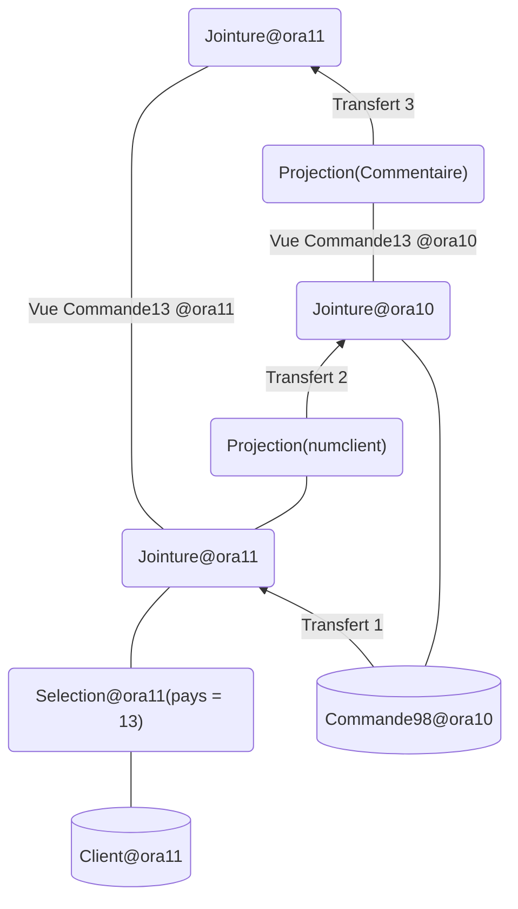

```mermaid
flowchart BT
Client[("Client@ora11")] --- Selection("Selection@ora11(pays = 13)")
Selection --- Jointure("Jointure@ora11")

Jointure ---Projection("Projection(numclient)")
Projection -->|Transfert 2|Jointure2("Jointure@ora10")
Commande98[("Commande98@ora10")] ---Jointure2

Jointure2 ---|"Vue Commande13 @ora10"|Projection2("Projection(Commentaire)")
Projection2 -->|Transfert 3|Jointure3("Jointure@ora11")
Jointure ---|"Vue Commande13 @ora11"|Jointure3

Commande98[("Commande98@ora10")] -->|Transfert 1|Jointure
```
