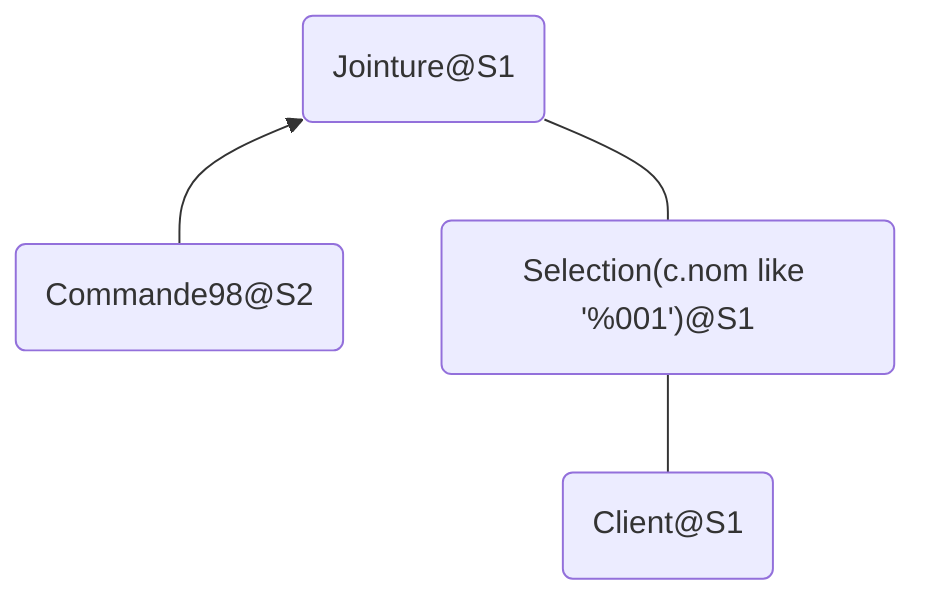
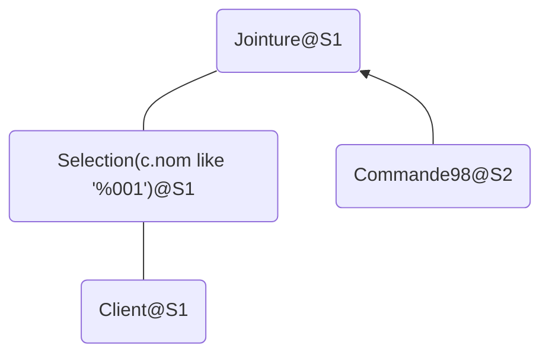
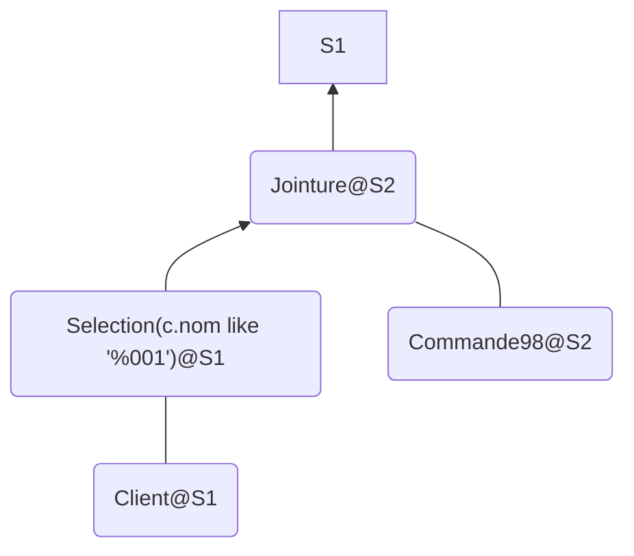
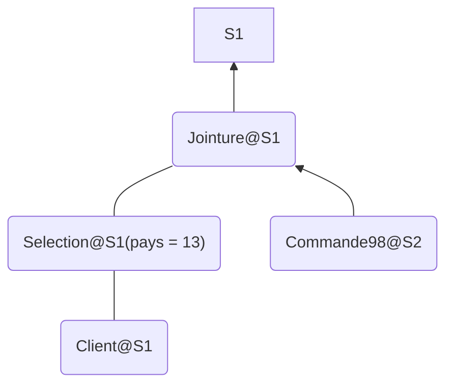
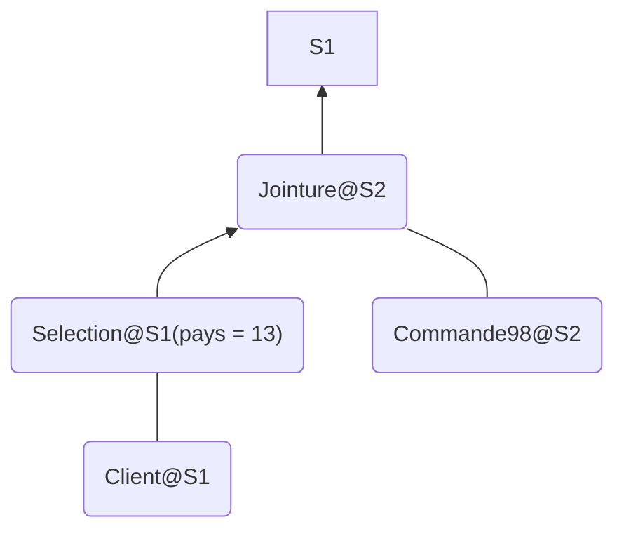
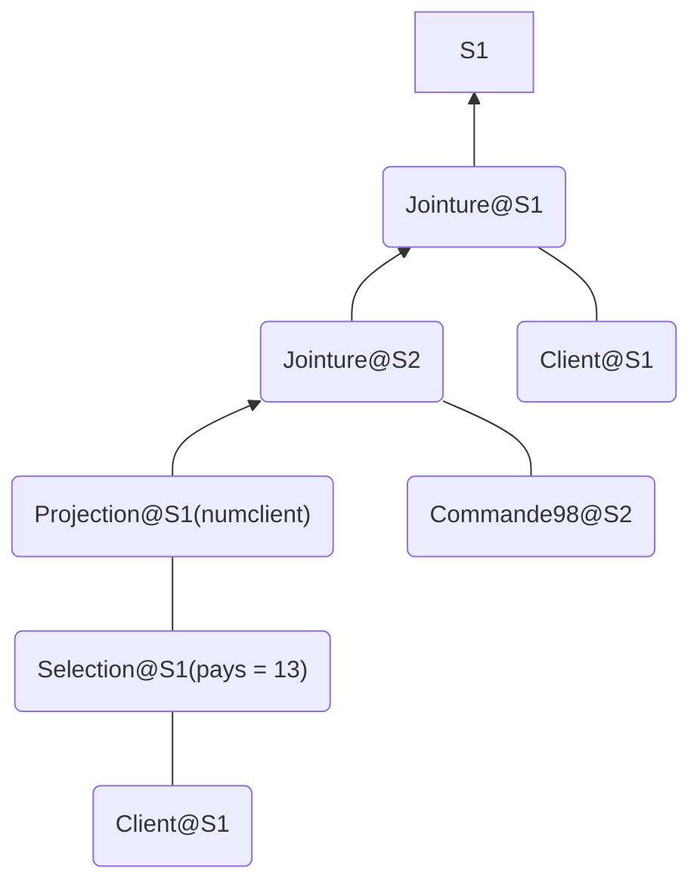

# SAM - TME6

**Note** : sur les dessins d'arbre, les flèches représentent des transferts d'un site à l'autre.

## Exercice 1 :  Requête traitée entièrement sur un site distant
#### Plan
```
----------------------------------------------------------------------------------------------

| Id | Operation | Name | Rows | Bytes | Cost (%CPU)| Time | Inst |

----------------------------------------------------------------------------------------------

| 0 | SELECT STATEMENT REMOTE| | 3 | 408 | 70 (2)| 00:00:01 | |

|* 1 | TABLE ACCESS FULL | COMMANDE98 | 3 | 408 | 70 (2)| 00:00:01 | ORA10 |

----------------------------------------------------------------------------------------------
```
**SELECT STATEMENT REMOTE** : toute la requête se fait à distance, avant d'être retourné vers le site original. Cela évite de transférer toutes les commandes vers le site original.

## Exercice 2 : Jointure locale utilisant des données distantes
### R2 : jointure NL
```sql
select /*+ USE_NL(c1 c) ordered */ *
from Commande98@siteComplement.fr c1, Client c
where c.numClient = c1.numClient;
```
#### Plan
```
-------------------------------------------------------------------------------------------------------------------

| Id | Operation | Name | Rows | Bytes | Cost (%CPU)| Time | Inst |IN-OUT|

-------------------------------------------------------------------------------------------------------------------

| 0 | SELECT STATEMENT | | 82 | 20336 | 166 (0)| 00:00:03 | | |

| 1 | NESTED LOOPS | | | | | | | |

| 2 | NESTED LOOPS | | 82 | 20336 | 166 (0)| 00:00:03 | | |

| 3 | REMOTE | COMMANDE98 | 82 | 11152 | 2 (0)| 00:00:01 | SITEC~ | R->S |

|* 4 | INDEX RANGE SCAN | I_CLIENT_NUMCLIENT | 1 | | 1 (0)| 00:00:01 | | |

| 5 | TABLE ACCESS BY INDEX ROWID| CLIENT | 1 | 112 | 2 (0)| 00:00:01 | | |

-------------------------------------------------------------------------------------------------------------------

Predicate Information (identified by operation id):

---------------------------------------------------

4 - access("C"."NUMCLIENT"="C1"."NUMCLIENT")
```
Lit toute la table Commande98 à distance, renvoie vers original puis fait la jointure par boucles imbriquées sur l'index Client(numClient).

coût(Commande98 $\bowtie_{numClient}$ Client) = coût(Commande98) + card(Commande98) × card($\sigma_\text{numClient}=v$(Client)) si index S(a)  
Soit : P(Commande98) * 0.27 + 20506.

### R3 : jointure Hash
```sql
select /*+ use_hash(c1 c)*/ *
from Commande98@siteComplement.fr c1, Client c
where c.numClient = c1.numClient;
```
#### Plan
```
-------------------------------------------------------------------------------------------------------------------

| Id | Operation | Name | Rows | Bytes | Cost (%CPU)| Time | Inst |IN-OUT|

-------------------------------------------------------------------------------------------------------------------

| 0 | SELECT STATEMENT | | 4 | 992 | 166 (0)| 00:00:03 | | |

| 1 | NESTED LOOPS | | | | | | | |

| 2 | NESTED LOOPS | | 4 | 992 | 166 (0)| 00:00:03 | | |

| 3 | REMOTE | COMMANDE98 | 82 | 11152 | 2 (0)| 00:00:01 | SITEC~ | R->S |

|* 4 | INDEX RANGE SCAN | I_CLIENT_NUMCLIENT | 1 | | 1 (0)| 00:00:01 | | |

|* 5 | TABLE ACCESS BY INDEX ROWID| CLIENT | 1 | 112 | 2 (0)| 00:00:01 | | |

-------------------------------------------------------------------------------------------------------------------

Remote SQL Information (identified by operation id):

----------------------------------------------------

3 - SELECT "NUMCDE","NUMCLIENT","ETAT","PRIXC","DATEC","PRIORITE","VENDEUR","COMMENTAIRE" FROM "COMMANDE98" "C1" (accessing 'SITECOMPLEMENT.FR' )
```

### R4 : Montrer que la sélection du prixC est "déléguée" au site distant
```sql
select /*+ use_hash(c1 c)*/ *  
from  
Commande98@siteComplement.fr c1, Client c  
where c.numClient = c1.numClient  
AND c1.prixC= 1000;
```

### R5 : Jointure sur toutes les commandes de 98 et le client dont le nom se termine par '001'
```sql
select *  
from Commande98@siteComplement.fr c1, Client c  
where c.numClient = c1.numClient  
and c.nom like '%001';
```
#### Plan
```
-------------------------------------------------------------------------------------------------

| Id | Operation | Name | Rows | Bytes | Cost (%CPU)| Time | Inst |IN-OUT|

-------------------------------------------------------------------------------------------------

| 0 | SELECT STATEMENT | | 1254 | 497K| 697 (1)| 00:00:09 | | |

|* 1 | HASH JOIN | | 1254 | 497K| 697 (1)| 00:00:09 | | |

|* 2 | TABLE ACCESS FULL| CLIENT | 2112 | 556K| 627 (1)| 00:00:08 | | |

| 3 | REMOTE | COMMANDE98 | 25076 | 3330K| 69 (0)| 00:00:01 | SITEC~ | R->S |

-------------------------------------------------------------------------------------------------
```
=> Commande98 renvoie toutes les données avant de faire la jointure

#### Arbre


### R6 : directive ORDERED
```sql
select /*+ ordered*/ *  
from Client c, Commande98@siteComplement.fr c1  
where c.numClient = c1.numClient and c.nom like '%001';
```
ORDERED donc il fait d'abord Client puis Commande98, beacoup plus opti : on lit beaucoup moins de données en remote car le filtre a déjà était fait dans la lecture séquentielle de client.

#### Plan
```
-------------------------------------------------------------------------------------------------

| Id | Operation | Name | Rows | Bytes | Cost (%CPU)| Time | Inst |IN-OUT|

-------------------------------------------------------------------------------------------------

| 0 | SELECT STATEMENT | | 4 | 992 | 186 (1)| 00:00:03 | | |

|* 1 | HASH JOIN | | 4 | 992 | 186 (1)| 00:00:03 | | |

|* 2 | TABLE ACCESS FULL| CLIENT | 2112 | 231K| 184 (1)| 00:00:03 | | |

| 3 | REMOTE | COMMANDE98 | 82 | 11152 | 2 (0)| 00:00:01 | SITEC~ | R->S |

-------------------------------------------------------------------------------------------------
```
#### Arbre


### R7 : DRIVING_SITE
```sql
select /*+ DRIVING_SITE( c1) */ *  
from Commande98@siteComplement.fr c1, Client c  
where c.numClient = c1.numClient and c.nom like '%001';
```
#### Plan
Si on met DRIVING_SITE sur Client, c'est la requête 5 sinon : 
```
-----------------------------------------------------------------------------------------------------

| Id | Operation | Name | Rows | Bytes | Cost (%CPU)| Time | Inst |IN-OUT|

-----------------------------------------------------------------------------------------------------

| 0 | SELECT STATEMENT REMOTE| | 2509 | 607K| 189 (3)| 00:00:03 | | |

|* 1 | HASH JOIN | | 2509 | 607K| 189 (3)| 00:00:03 | | |

| 2 | REMOTE | CLIENT | 2112 | 231K| 118 (2)| 00:00:02 | ! | R->S |

| 3 | TABLE ACCESS FULL | COMMANDE98 | 20506 | 2723K| 70 (2)| 00:00:01 | ORA10 | |

-----------------------------------------------------------------------------------------------------
```
Il fait tout en remote, c'est comme si on exécutait la requête depuis le site complément et que le site complémentaire est le site original.

#### Arbre


## Exercice 4 : Réduire la quantité de données transférées
Plusieurs plans possibles :

### Plan 1
*Inconvénient* : des commandes inutiles sont transférées.

```sql
Select /*+ DRIVING_SITE(cl) */
cl.profile, co.commentaire
From Client cl, Commande98@siteComplement.fr co
Where cl.numClient = co.numClient
and cl.numPays = 13;
```
Coût = 697

### Plan 2
*Inconvénient* : des attributs de Client partent (de S2) et reviennent (en S1) pour rien.

```sql
Select /*+ DRIVING_SITE(co) */
cl.profile, co.commentaire
From Client cl, Commande98@siteComplement.fr co
Where cl.numClient = co.numClient
and cl.numPays = 13;
```
Equivalent à créer une vue sur le site complément :
```sql
CREATE VIEW COMMANDE13 AS 
SELECT cl.profile, co.commentaire
FROM CLIENT@SITEORIGINAL.fr CL, COMMANDE98 CO 
WHERE CL.NUMCLIENT=CO.NUMCLIENT AND CL.NUMPAYS=13;
```
Coût = 469

### Plan 3

Vue associée (site distant) :
```sql
CREATE VIEW C13 AS
SELECT /*+ DRIVING_SITE(CO) */
CL.NUMCLIENT, CO.COMMENTAIRE 
FROM CLIENT@SITEORIGINAL.fr CL, COMMANDE98 CO
WHERE CL.NUMCLIENT = CO.NUMCLIENT AND CL.NUMPAYS=13;
```
Requête sur le site original :
```sql
SELECT CL.PROFILE, C13.COMMENTAIRE
FROM CLIENT CL, C13@SITECOMPLEMENT.FR
WHERE CL.NUMCLIENT = C13.NUMCLIENT;
```
#### Plan
```
---------------------------------------------------------------------------------------------

| Id | Operation | Name | Rows | Bytes | Cost (%CPU)| Time | Inst |IN-OUT|

---------------------------------------------------------------------------------------------

| 0 | SELECT STATEMENT | | 25076 | 5607K| 697 (1)| 00:00:09 | | |

|* 1 | HASH JOIN | | 25076 | 5607K| 697 (1)| 00:00:09 | | |

| 2 | REMOTE | C13 | 25076 | 1591K| 69 (0)| 00:00:01 | SITEC~ | R->S |

| 3 | TABLE ACCESS FULL| CLIENT | 42247 | 6766K| 627 (1)| 00:00:08 | | |

---------------------------------------------------------------------------------------------
```
Coût = 697
